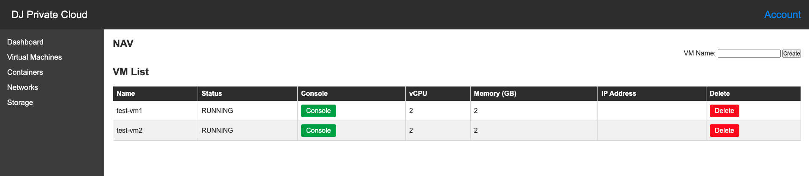

# EasyStack


List VMs
```shell
./es list
Getting list of VMs
VM: test-vm1
VM: test-vm2
```
Create VM
```shell
./es create test-vm3
VM Created: test-vm3
Started VM: test-vm3

./es list
Getting list of VMs
VM: test-vm1
VM: test-vm2
VM: test-vm3
```

```shell
./es delete test-vm3

./es list
Getting list of VMs
VM: test-vm1
VM: test-vm2
```

